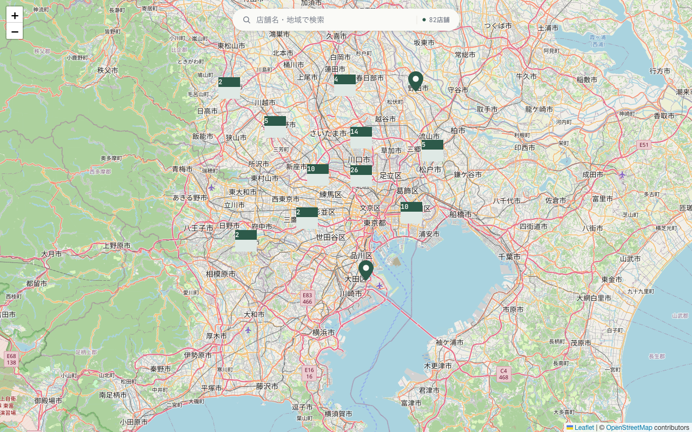
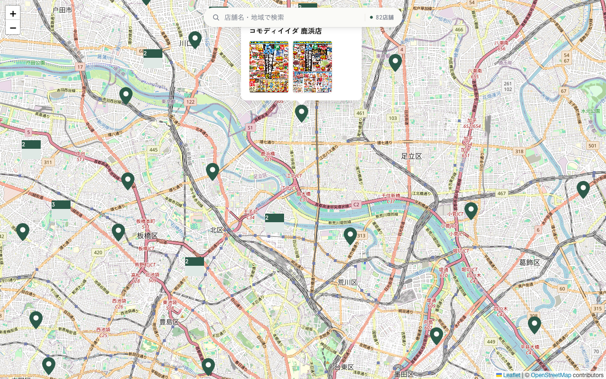
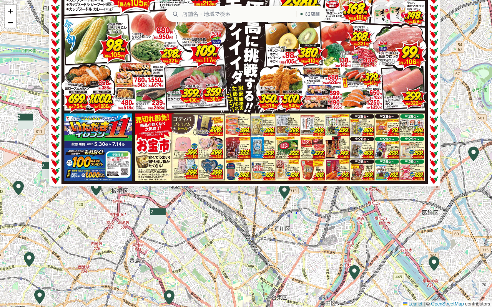

# User Guide — Comodi Iida Flyer Map

A map of current promotion flyers for all Comodi Iida supermarket stores.

Live site: https://comodi-iida-flyer-map.vercel.app

## Finding a store

The map opens centered on the Tokyo/Kanto area with all ~82 stores shown as
pins. Nearby stores are grouped into numbered clusters — click a cluster to
zoom in until it splits into individual pins.

Use the search box at the top of the map to filter by store name or address
(Japanese). The counter next to the search box ("◯◯店舗") shows how many
stores currently match. Clearing the search box shows all stores again.

## Viewing a store's flyers

Click any pin to see that store's current flyers.

- **On desktop**, a popup opens above the pin showing the store name and
  thumbnails of its current flyers.
- **On mobile** (narrow screens), the flyers open in a panel at the bottom
  of the screen instead of a popup. Tap the **×** button to close it.

If a store currently has no flyers posted, the popup/panel says so instead
of showing thumbnails.

## Reading a flyer

Click (or tap) any flyer thumbnail to open it full-size. Click anywhere on
the full-size image to close it and return to the store popup.

## Notes

- Flyer data is refreshed automatically on a daily schedule — flyers that a
  store has stopped posting are removed.
- The map and flyer images require an internet connection; there is no
  offline mode.
